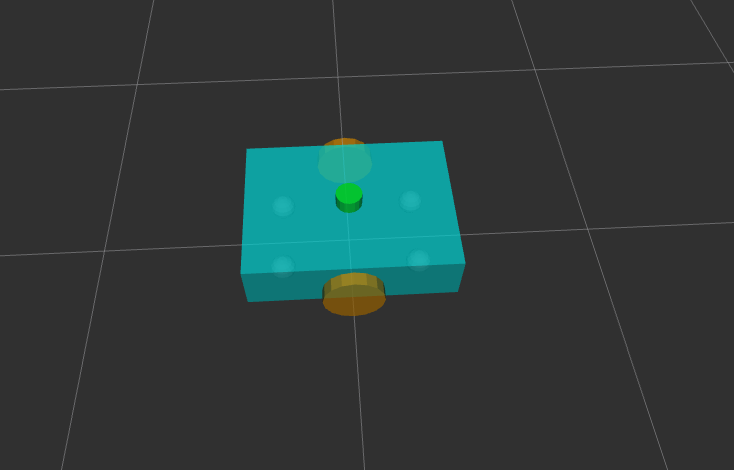

# questbot_description



## Overview
This repository contains the ROS2 launch files, descriptions, and configurations for the **QuestBot** robot. The project is designed to work with different modules like robot state publishing, RViz visualization, and more, making it easy to set up and extend. 


## 🧑‍💻 Setup

1. 📂 Clone the repository
```
mkdir -p ~/ros_ws/src
cd ~/ros_ws/src
git clone  https://github.com/manojm-dev/questbot_description.git
```

2) 📦 Install dependencies
```
cd ~/ros_ws
sudo apt-get update -y && rosdep update && rosdep install --from-paths src --ignore-src -y
```

3) 🛠️ Building the packages
```
cd ~/ros_ws
colcon build
```

## Usage

### Launching Robot State Publisher
To launch the robot state publisher and visualize the robot in RViz:
```bash
ros2 launch questbot_ros2_project rsp.launch.py
```

### Launching Robot State Publisher with Joint State and RViz Visualization
To launch the robot state publisher, joint state publisher, and RViz visualization in one go:
```bash
ros2 launch questbot_ros2_project display.launch.py
```

## Launch File Details

### `rsp.launch.py`
This launch file starts the **robot_state_publisher** node, which reads the URDF description of the robot and publishes it to the ROS2 topic `/robot_description`. It is designed to work with a simplified setup where you only need to publish the robot's state.

### `display.launch.py`
This launch file starts:
- **robot_state_publisher**: Publishes the robot's state.
- **joint_state_publisher**: Simulates joint states.
- **rviz2**: Opens RViz with a custom configuration to visualize the robot’s state.


## 👨‍💻 Author
Made with ❤️ by Manoj M